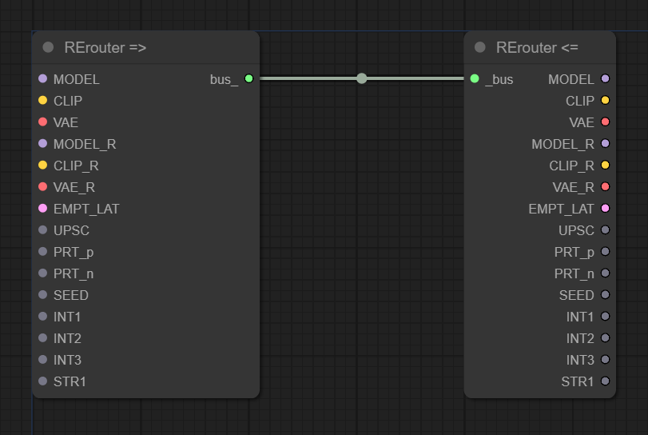
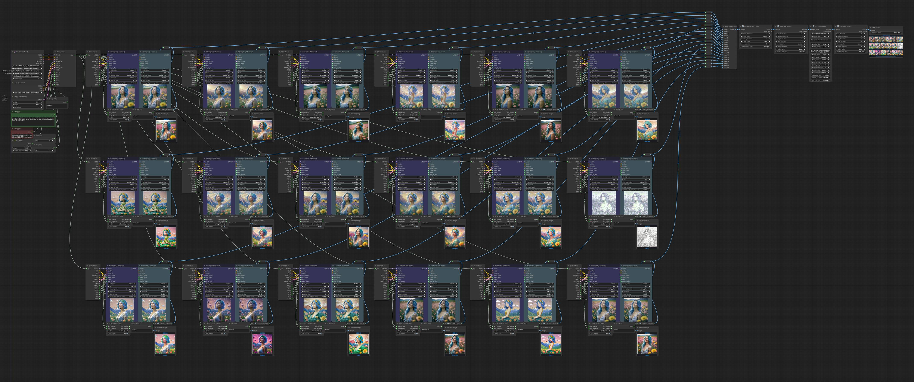

# ComfyUI_RErouter_CustomNodes

* ### Install:
  * ###### cd ComfyUI\custom_nodes
  * ``` git clone https://github.com/an90ray/ComfyUI_RErouter_CustomNodes.git ```

* ### Update:
  * ###### cd ComfyUI\custom_nodes\ComfyUI_RErouter_CustomNodes
  * ``` git pull https://github.com/an90ray/ComfyUI_RErouter_CustomNodes.git ```

## 


## Usage example


